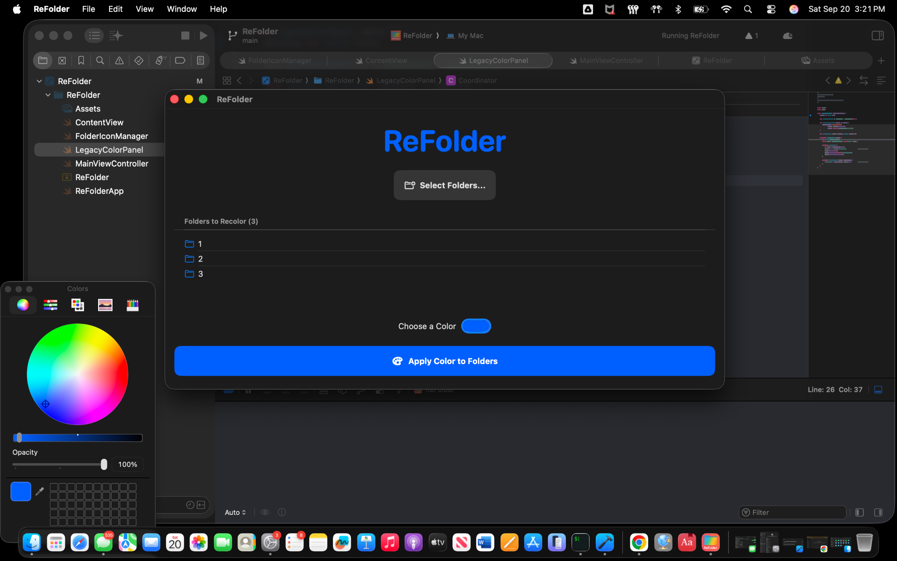
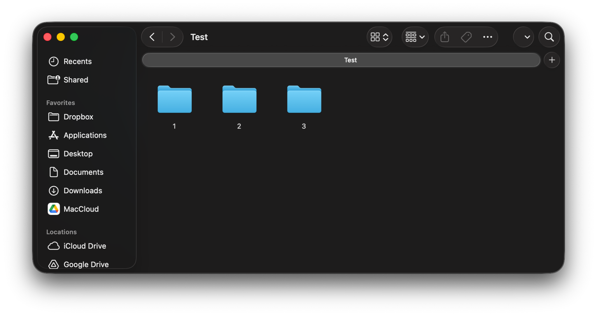
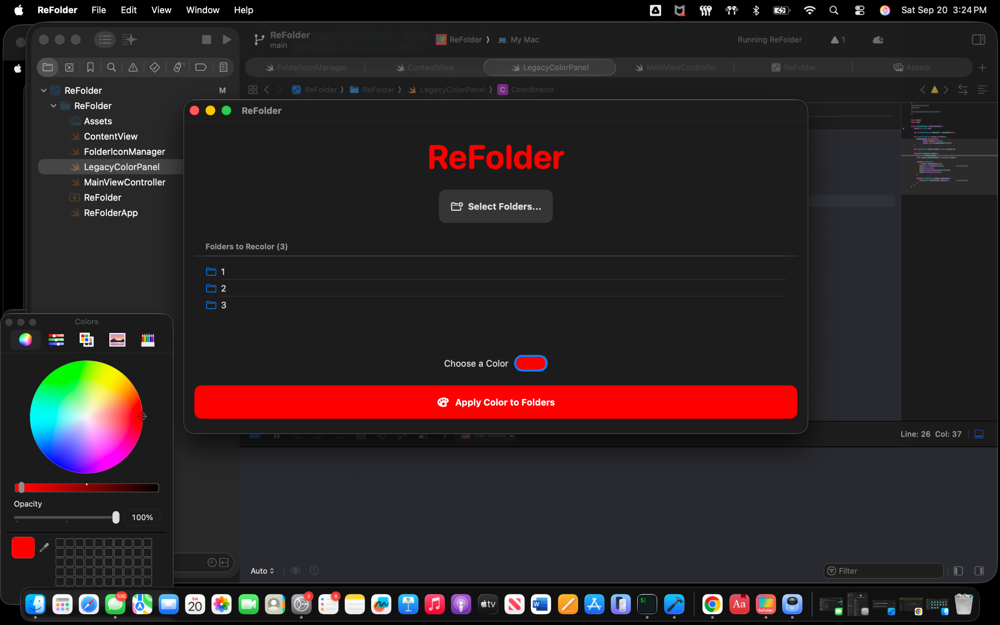
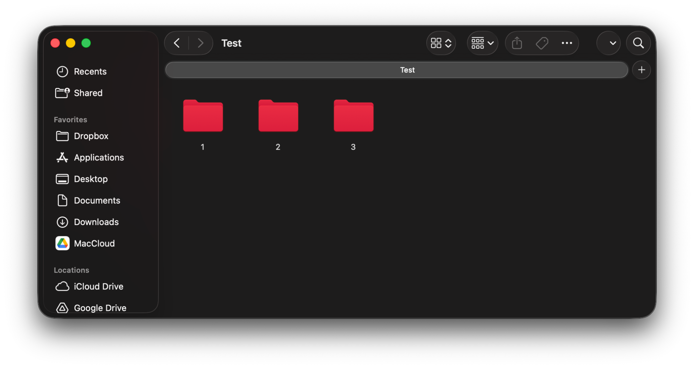

# ReFolder

ReFolder is a tiny macOS utility I made to quickly recolor multiple folders with one click. I built this before macOS Tahoe 26, which later added a native way to change folder colors via Apple's folder/file tags. I originally made this as a way to conviniently color-code my course work diretories so I could easily identify them.

## What it does

- Select multiple folders and apply one color to all of them
- Uses the system macOS Colors panel (so your usual color pickers work)
- Sets a per‑folder custom icon behind the scenes

## Before / After

**Before**

**After**

## How to use

1. Click **Select Folders…** and choose one or more folders.
2. Choose a color using the **Colors** panel.
3. Hit **Apply Color to Folders**.
4. If Finder doesn’t update right away, open a new window or Option‑click the Finder icon → Relaunch to refresh its icon cache.

## Compatibility

Designed for macOS **prior to the release of Tahoe 26**. It may still work later, but note that macOS now includes a native folder‑color option.

## Building

Open the project in Xcode, select My Mac (macOS) as the run target, and build.
